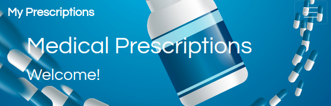

# My Prescriptions

This app was developed to fulfill doctor's needs.

It manages the patients information, allows to record prescriptions and observations on each visit keeping a medical record.

Fully on-line.

## Technologies used

- HTML
- CSS
- Bootstrap
- Javascript
- JQuery
- Ajax
- Node JS
- Express Web Server
- Handlebars
- MySQL / JawsDB database
- Sequelize
- MVC methodology (Model View Controller)

## To use the app

- Download files from GitHub
- Install dependencies (npm install)
- Configure database access (config/config.json)

----------------

This is the second team project 

for the Coding Bootcamp 

Tecnologico de Monterrey

Developed in Mexico

June/2019

by:

Mayra Cuenca

Hugo Moreno

Jesus Colunga

---

We thank our families for the support and patience while the bootcamp.